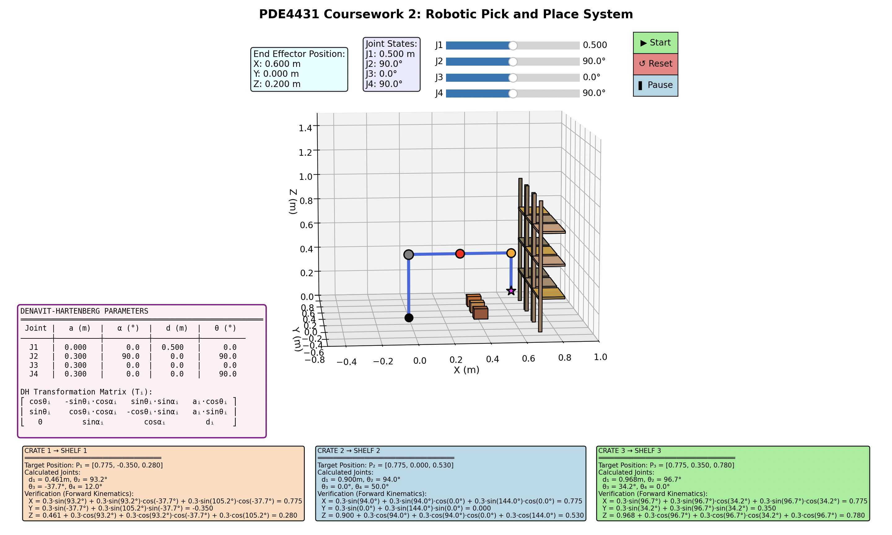
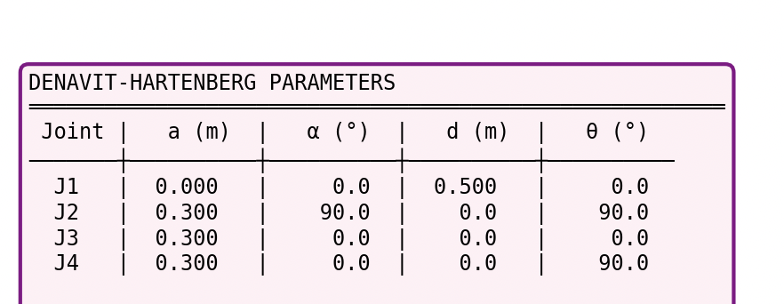
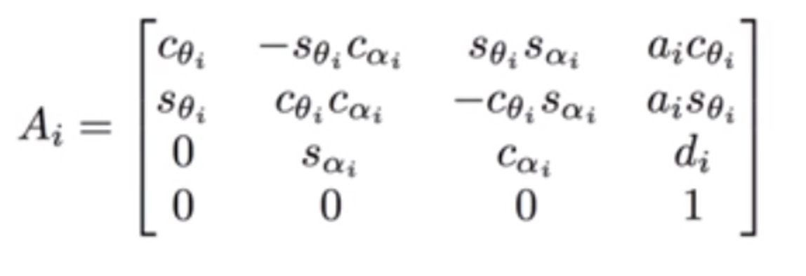
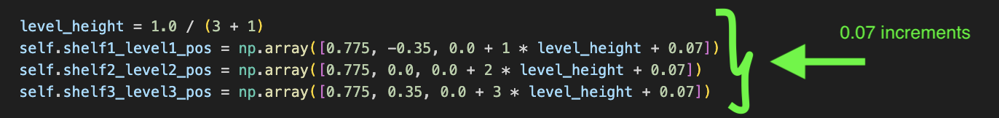
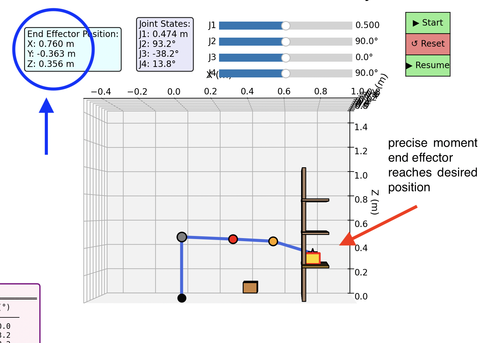

# PDE4431 Coursework 2  
## Industrial Manipulator Kinematics Modelling (Simulation-Based)

**Module:** PDE4431  
**Coursework:** 2  
**Location:** Dubai  
**Deadline:** December 11th, 2025 (23:59 Dubai Time)

---

## Project Overview

This project presents the design and kinematic modelling of an industrial robotic manipulator developed **purely in simulation** using Python. The system is designed to perform a structured **pick-and-place task**, where three objects (crates) are picked up from the floor and placed onto three shelves located at different heights and lateral positions.

The primary objective is to validate the **kinematic feasibility** of the manipulator design—specifically the arrangement of links and joints—before any physical implementation. The robot is modelled as a *stick-figure manipulator*, in line with standard engineering practice for early-stage design verification.

---

## Task Description

The manipulator must:

- Pick up **three separate crates** from the floor.
- Place each crate onto a **specific shelf and level**:
  - Crate 1 → Shelf 1, Level 1  
  - Crate 2 → Shelf 2, Level 2  
  - Crate 3 → Shelf 3, Level 3
- Operate entirely in simulation.
- Demonstrate that the **end-effector can accurately reach all required target positions**.

A complete animated sequence is provided to visually confirm task execution.

---

## Robot Configuration

### Joint Structure

The robot consists of **four joints**, satisfying the coursework requirements:

| Joint | Type       | Axis of Motion | Description |
|------|-----------|----------------|-------------|
| J1   | Prismatic | Z-axis         | Vertical base lift |
| J2   | Revolute  | Y-axis         | Shoulder joint |
| J3   | Revolute  | Z-axis         | Lateral reach (side shelves) |
| J4   | Revolute  | Y-axis         | Wrist/extension joint |

This configuration allows the manipulator to reach shelves at different heights and lateral offsets.

---

## Simulation Environment

- **Language:** Python  
- **Libraries:**  
  - `NumPy` (numerical computation)  
  - `Matplotlib` (3D visualisation, animation, UI widgets)

### Scene Layout

- Three crates positioned on the floor in front of the robot.
- Three shelves aligned along the X-axis, each with three levels.
- Target shelf levels are visually highlighted.
- A graphical user interface includes:
  - Sliders for manual joint control
  - Buttons to start, pause, resume, and reset the animation

📌 **Initial setup of the simulation environment:**

  
*(Insert image of setup)*

---

## Animation Sequence

When the **Start** button is pressed, the following sequence is executed automatically:

1. Pick up **Crate 1** from the floor  
2. Place Crate 1 on **Shelf 1 – Level 1**  
3. Return to the home position  
4. Pick up **Crate 2**  
5. Place Crate 2 on **Shelf 2 – Level 2**  
6. Return to the home position  
7. Pick up **Crate 3**  
8. Place Crate 3 on **Shelf 3 – Level 3**

The full motion is smoothly animated, demonstrating reachability and joint coordination.

---

## Denavit–Hartenberg (D–H) Parameters

To formally define the robot geometry, **Denavit–Hartenberg parameters** are used. These parameters serve as the kinematic input to the Python simulation and define:

- Link lengths
- Joint types
- Coordinate frame orientations

📌 **D–H parameter table used in the simulation:**

The parameters were chosen to ensure:
- Physical plausibility
- Adequate workspace coverage
- Numerical stability in simulation

---

## Kinematics Modelling

### Forward Kinematics

Forward kinematics is implemented to compute the position of each joint and the end effector from a given set of joint variables. This is used to:

- Plot the robot configuration in 3D
- Verify that target positions are reached
- Animate joint motion during the pick-and-place task

📌 **Forward kinematics formulation:**

---

### Inverse Kinematics

Inverse kinematics calculations were performed to determine joint values required to reach each crate and shelf target position. These values are hard-coded into the animation sequences and verified using forward kinematics.

📌 **Inverse kinematics calculation results:**

📌 **Actual end-effector position verification:**

---

### Z-Axis Visual Offset

It is important to note that a small **Z-axis offset of +0.07 m** is intentionally added when a crate is attached to the end effector. This adjustment ensures that:

- The end effector appears **above the crate**, not intersecting it
- The animation is more **visually realistic and clear**

📌 **Code segment applying the Z-axis increment:**

As a result, minor differences may appear between calculated Z-values and displayed end-effector positions. This does not affect the correctness of the kinematic model.

---

## Assessment Criteria Coverage

This project satisfies the **Distinction (1–4)** rubric criteria:

- ✔ Appropriate D–H parameter selection  
- ✔ Fully animated pick-and-place sequence  
- ✔ Clear 3D visualisation with annotations  
- ✔ Inverse kinematics implementation  
- ✔ Independent enhancements beyond taught material  

---

## Conclusion

This coursework demonstrates a complete and well-structured approach to **industrial manipulator kinematic modelling**. Through careful joint design, D–H parameterisation, and animated simulation, the robot successfully completes a multi-stage pick-and-place task entirely in software, validating the design prior to any physical implementation.

---
